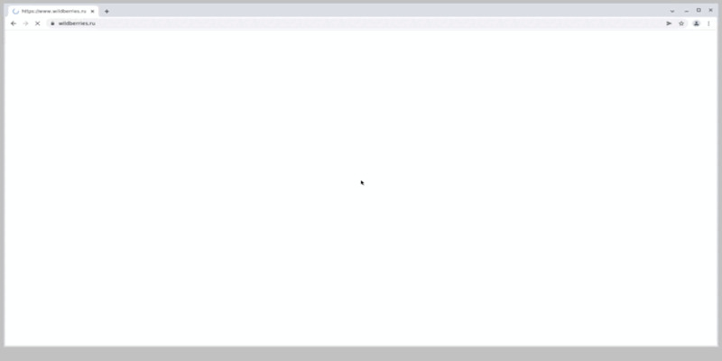
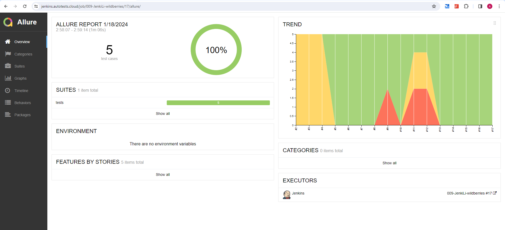
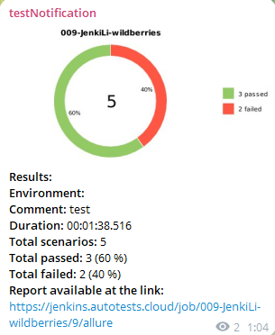
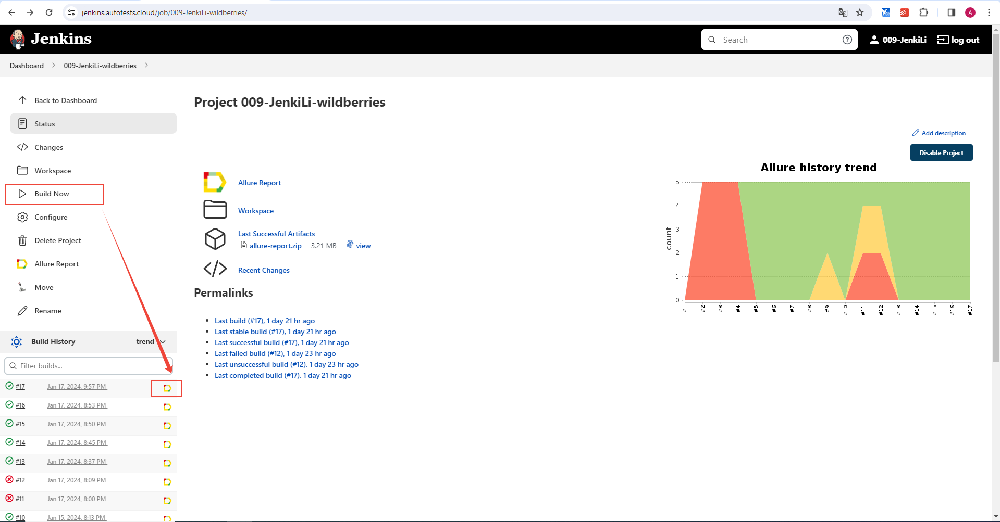

<h1 align="center">Проект по тестированию интернет-магазина <a href="https://www.wildberries.ru/"> Wildberries </a> </h1>


### Стек: Python, Selene, Pytest, Jenkins, Selenoid, Allure-report
<p align="left">


</p>

---

### Автотестами проверяется:

- Добавление товара в корзину  
- Удаление товара из корзины
- Поиск товара по названию  
- Поиск товара по артикулу  
- Поиск несуществующего товара  

Пример выполнения теста


  

---

Отчёт о прохождении будет сгенерирован в allure-report с подробными шагами, скриншотами, видео.
Также, при необходимости можно подключить уведомления в Telegram, skype, discord, slack  


  
.

---


### Как запустить

###### Удаленно

1. Открыть <a href="https://jenkins.autotests.cloud/job/009-JenkiLi-wildberries/"> jenkins-control  </a>
2. Нажать Build now
3. Дождаться завершения 
4. Перейти в allure отчет

  

###### Локально

1. Клонируйте репозиторий
```ruby
git clone https://github.com/AlikGallyamov/Wildberries.git
```
2. Создайте и активируйте виртуальное окружение
  ```ruby
  cd Wildberries
  python -m venv .venv
  .venv/Scripts/activate
  ```
3. Установите зависимости с помощью pip
  ```ruby
  pip install -r requirements.txt
  ```
3. Установите  <a href="https://repo.maven.apache.org/maven2/io/qameta/allure/allure-commandline/2.26.0/allure-commandline-2.26.0.zip"> Allure </a>. Распакуйте архив в папку с проектом. Распакованную папку переименуйте в "allure"
4. Запустите автотесты 
  ```ruby
  pytest tests
  ```
5. Получите отчёт allure
```ruby
allure serve allure-results
``` 


