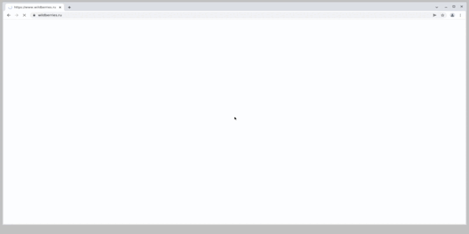
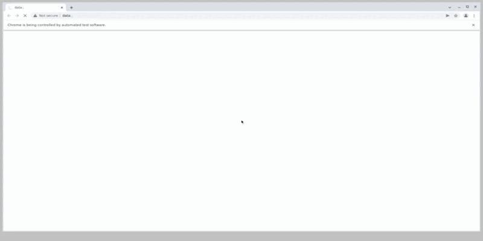
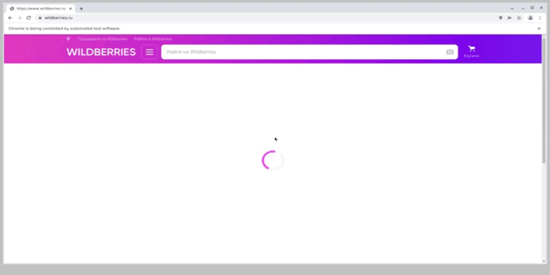

<h1 align="center">Проект по тестированию интернет-магазина <a href="https://www.wildberries.ru/"> Wildberries </a> </h1>

### Автотестами проверяется:

- Добавление товара в корзину  
  

- Удаление товара из корзины
  

- Поиск товара по названию  
  

- Поиск товара по артикулу  

---

### Стек: Python, Selene, Pytest, Jenkins, Selenoid, Allure-report

